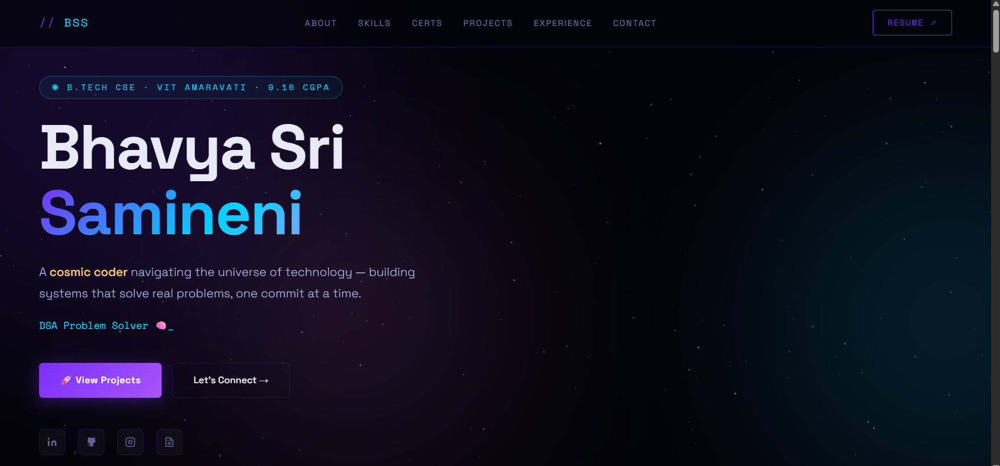
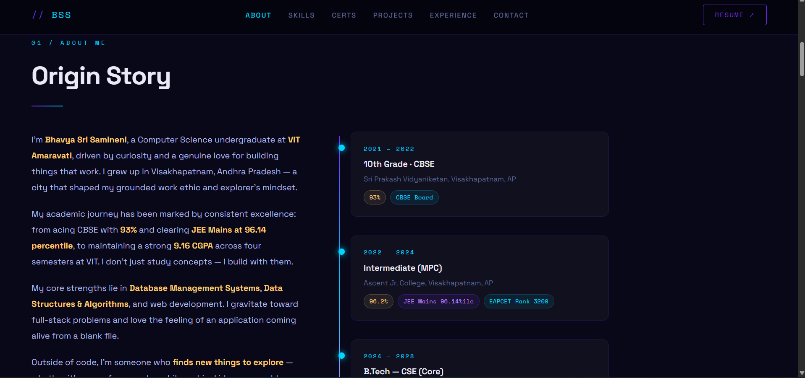
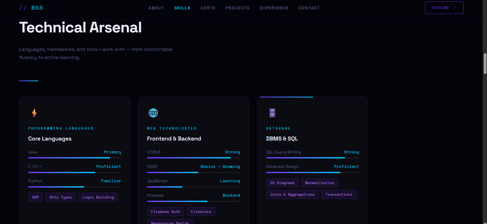
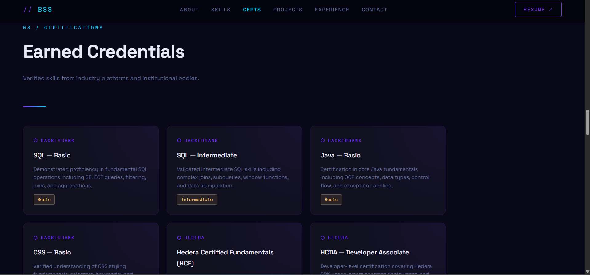
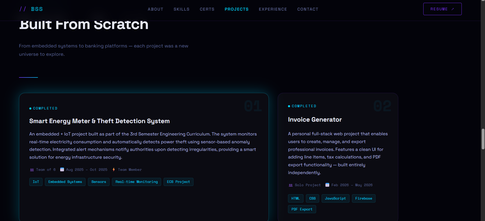
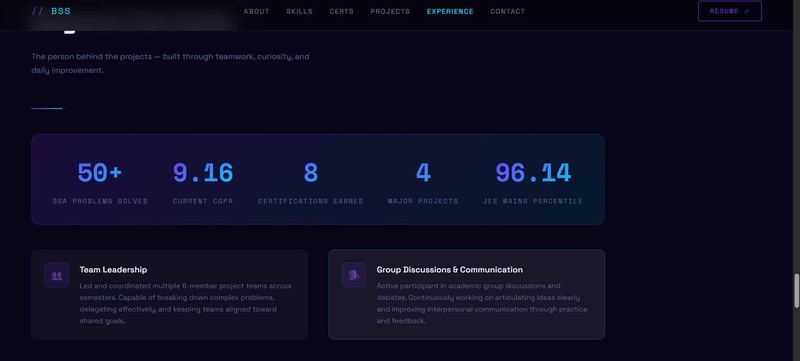
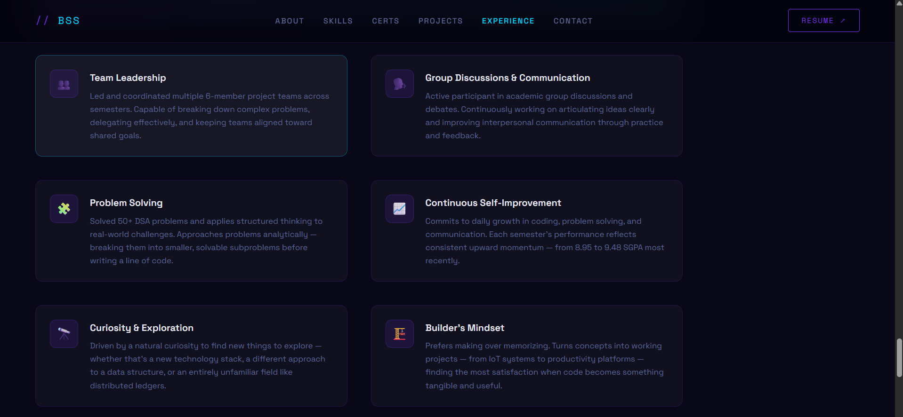
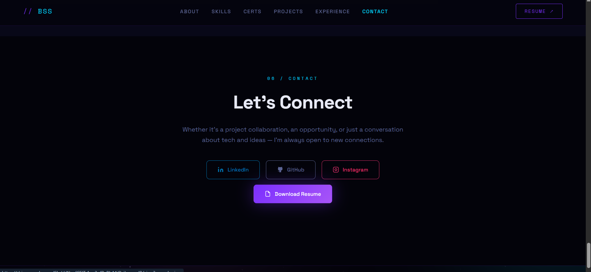

<div align="center">

<!-- HEADER BANNER -->


<br/>

[](https://git.io/typing-svg)

<br/>

[](https://bhavya-sri-samineni-portfolio.netlify.app/)
[](https://www.linkedin.com/in/bhavya-sri-samineni)
[](https://github.com/Bhavya-41206)
[](https://drive.google.com/file/d/1IqvfCEITrAoy3ofRaBhA1iD_iLpoyadR/view?usp=sharing)

</div>

---

## ✦ Overview

> *"A cosmic coder navigating the universe of technology — building systems that solve real problems, one commit at a time."*

This repository contains my **personal developer portfolio** — a space/cosmic dark-themed, fully interactive single-page site built with pure **HTML, CSS & JavaScript**. No frameworks. No dependencies. No build tools. Just hand-crafted code, pixel by pixel.

---

## 🖥️ Preview

### Hero — First Impression
> The landing section features a live animated starfield canvas, drifting nebula blobs, a typed role rotator, and quick-access social links.

<div align="center">
  
</div>

<br/>

### Origin Story — About Me
> An animated education timeline tracing the journey from 10th grade through B.Tech at VIT Amaravati, with scores and competitive exam results.

<div align="center">
  
</div>

<br/>

### Technical Arsenal — Skills
> Six skill cards covering programming languages, web technologies, DBMS, DSA, coursework, and tools — each with scroll-triggered animated progress bars.

<div align="center">
  
</div>

<br/>

### Earned Credentials — Certifications
> Eight certification cards from HackerRank, Hedera, and CSI Club — displayed with issuer, description, and level tags.

<div align="center">
  
</div>

<br/>

### Built From Scratch — Projects
> Major projects with status indicators (active / completed / team), tech tags, team size, duration, and role — including a featured full-width card for the flagship project.

<div align="center">
  
</div>

<br/>

### Beyond the Code — Experience & Qualities
> A live stats counter banner (DSA problems, CGPA, certifications, projects) and six quality cards covering leadership, communication, and problem-solving.

<div align="center">
  
  <br/><br/>
  
</div>

<br/>

### Let's Connect — Contact
> Clean contact section with direct links to LinkedIn, GitHub, Instagram, and Resume.

<div align="center">
  
</div>

---

## 🎨 Design System

```
Theme       →  Space / Cosmic Dark
Background  →  #03030a (void black) + procedural animated starfield
Accent 1    →  #7b2fff  (aurora purple)
Accent 2    →  #00d4ff  (nebula cyan)
Accent 3    →  #ff6ef7  (cosmic pink)
Accent 4    →  #ffc96e  (stardust gold)
Typography  →  Space Grotesk (display) + Space Mono (code/labels)
Cards       →  Glassmorphic — rgba(255,255,255,0.03) + border glow on hover
```

**Signature Element:** A procedurally animated HTML5 Canvas starfield with 280 individually twinkling stars and three drifting nebula blobs — every page load feels uniquely cosmic.

---

## 🛠️ Built With


| Technology | Usage |
|---|---|
| **HTML5 Canvas API** | Procedural starfield — 280 twinkling stars |
| **CSS Custom Properties** | Full design token system for theming |
| **CSS Animations** | Nebula drift, blink cursor, scroll hint, pulse dots |
| **IntersectionObserver API** | Scroll-triggered reveals & skill bar animations |
| **Vanilla JS** | Typed text rotator, DSA counter, nav highlight, progress bar |

> Zero frameworks · Zero npm · Zero build steps — open `index.html` and it works.

---

## ✨ Interactive Features

| Feature | How It Works |
|---|---|
| 🌟 **Live Starfield** | 280 stars rendered & twinkling on HTML5 Canvas |
| 🌌 **Nebula Blobs** | 3 CSS-animated radial blurs drifting in the background |
| ⌨️ **Typed Text Rotator** | Cycles through 7 developer roles with delete/retype animation |
| 📊 **Animated Skill Bars** | Scale from 0 → value on scroll via IntersectionObserver |
| 🔢 **DSA Counter** | Counts up to 50+ with setInterval when scrolled into view |
| 📜 **Scroll Progress Bar** | Gradient bar at top tracks reading position |
| 👁️ **Reveal Animations** | Cards fade + slide up as they enter the viewport |
| 🔵 **Active Nav Highlight** | Nav link glows cyan as its section is in view |
| 📱 **Mobile Nav Toggle** | Hamburger menu for screens below 900px |

---

## 🌌 Portfolio Sections

| # | Section | Highlights |
|---|---|---|
| 01 | 🪐 **Hero** | Name, tagline, typed rotator, social links, CTA |
| 02 | 🎓 **Origin Story** | Education timeline — 10th → Inter → B.Tech |
| 03 | ⚡ **Technical Arsenal** | Skills with animated bars + tag chips |
| 04 | 🏅 **Earned Credentials** | 8 certification cards with issuer + level |
| 05 | 🚀 **Built From Scratch** | 4 major projects + mini projects |
| 06 | 👥 **Beyond the Code** | Stats banner + 6 quality cards |
| 07 | 📡 **Let's Connect** | LinkedIn, GitHub, Instagram, Resume |

---

## 📁 File Structure

```
portfolio/
│
├── index.html              ← Entire portfolio (single self-contained file)
├── README.md               ← You are here
└── screenshots/
    ├── Name.png            ← Hero section
    ├── origion-story.png   ← About Me / Education
    ├── technical-arsenal.png  ← Skills
    ├── earned-credentials.png ← Certifications
    ├── projects.png        ← Projects
    ├── experience.png      ← Stats banner
    ├── experience_2.png    ← Quality cards
    └── connect.png         ← Contact section
```

---

## ⚡ Quick Start

```bash
# Clone the repository
git clone https://github.com/Bhavya-41206/portfolio.git

# Enter the folder
cd portfolio

# Open directly in your browser — no setup needed
open index.html        # macOS
start index.html       # Windows
xdg-open index.html    # Linux
```

---

## 🌐 Deploy in 60 Seconds

**GitHub Pages**
1. Push this repo to `Bhavya-41206.github.io`
2. **Settings → Pages → Deploy from `main` branch → `/ (root)`**
3. Live at `https://Bhavya-41206.github.io` ✨

**Netlify Drop**
1. Go to [app.netlify.com/drop](https://app.netlify.com/drop)
2. Drag the entire folder in
3. Instant live URL — no account needed

---

## 🤝 Connect With Me

<div align="center">

[](https://www.linkedin.com/in/bhavya-sri-samineni)
[](https://github.com/Bhavya-41206)
[](https://www.instagram.com/__bhavya__412/)
[](https://drive.google.com/file/d/1IqvfCEITrAoy3ofRaBhA1iD_iLpoyadR/view?usp=sharing)

</div>

---

<div align="center">


*Crafted from the cosmos · Bhavya Sri Samineni · VIT Amaravati · 2026*

</div>
